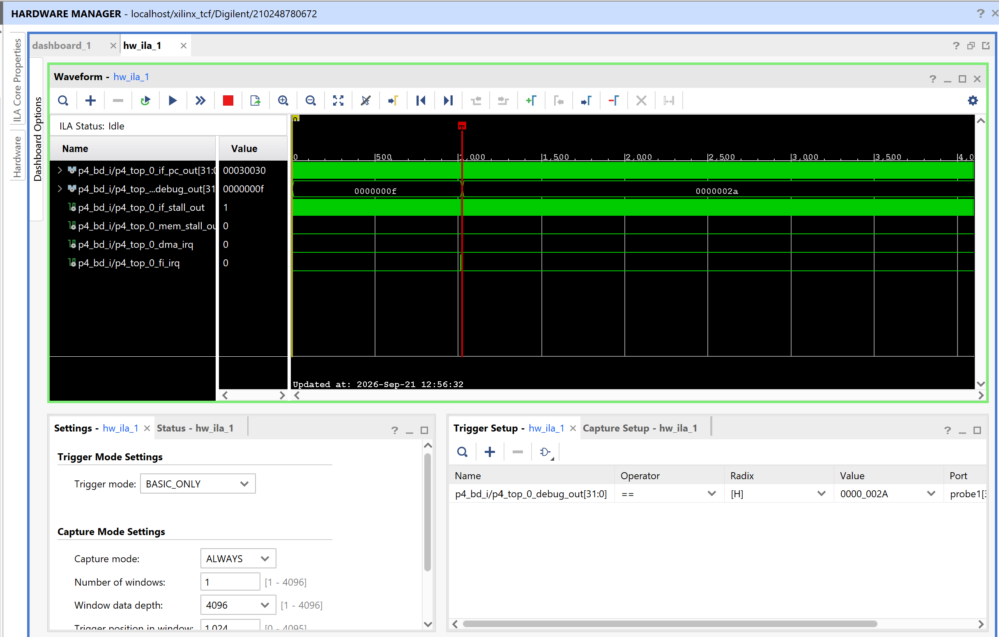
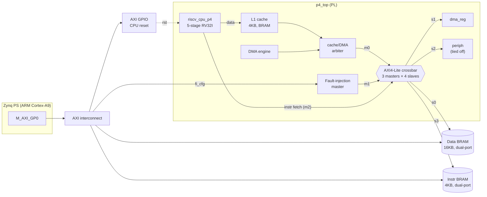
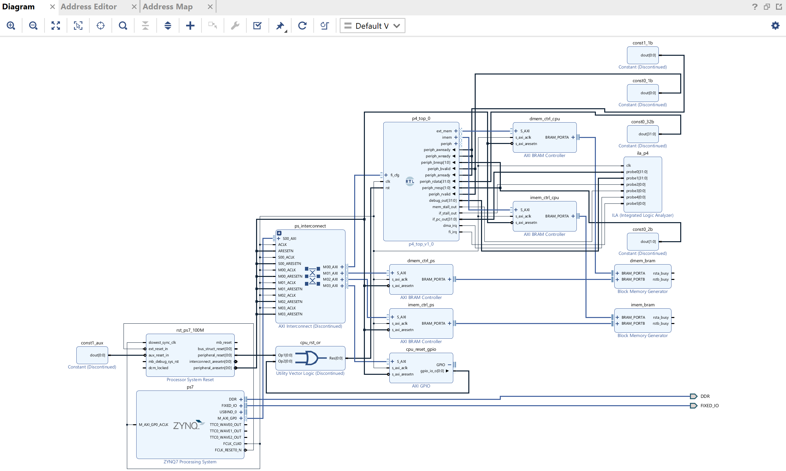
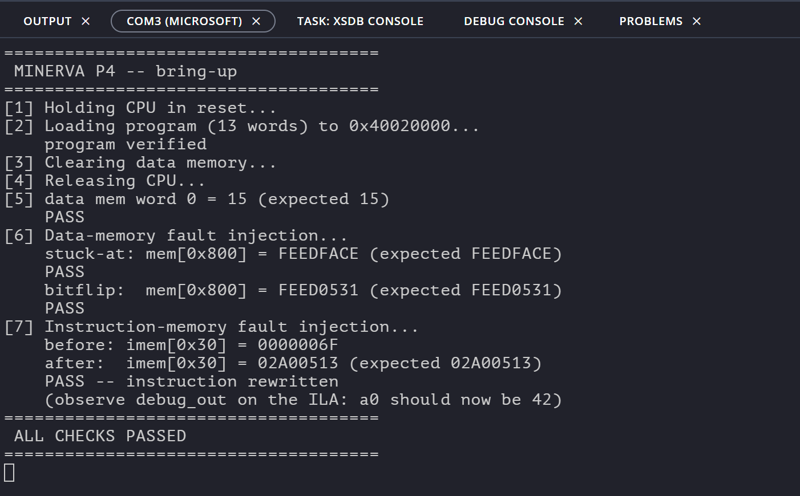
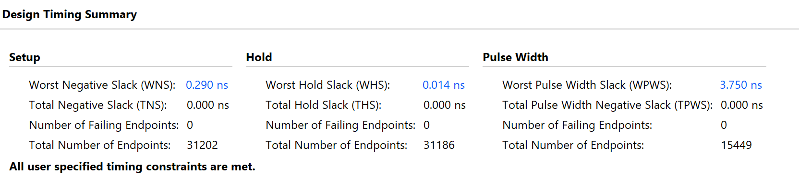
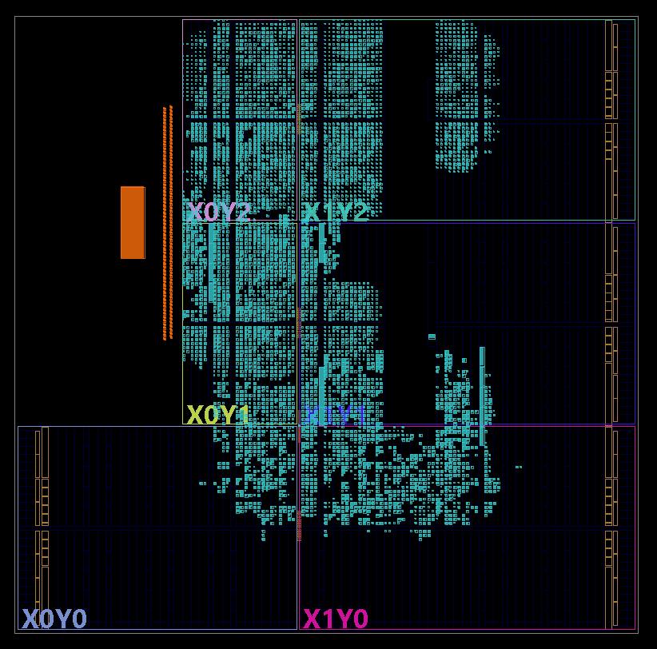
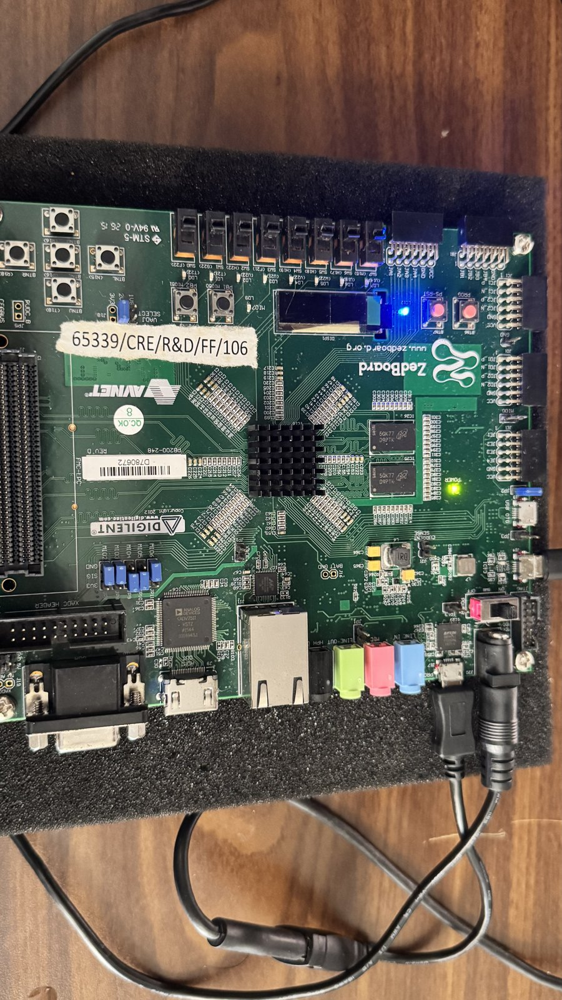

# MINERVA P4 — AXI4-Lite Crossbar, AXI Instruction Fetch & Fault Injection

**A 5-stage RV32I pipeline with an L1 cache and DMA, connected through a custom 3×4 AXI4-Lite crossbar, with a fault-injection master that can corrupt both data *and* instructions at runtime — closed at 100 MHz and demonstrated on a Zynq-7020 (ZedBoard).**

Part of **MINERVA**, a multi-phase RISC-V SoC built from the ground up. Each phase reuses the verified IP of the one before it.



> **The headline result.** The fault-injection master rewrites the CPU's spin instruction in instruction memory *over the interconnect*. The ILA triggers on `debug_out == 0x2A` and shows register `a0` change from `0x0F` to `0x2A` — with the `fi_irq` pulse marking campaign completion immediately before it. A fault written through the fabric, refetched by the running CPU, and changing architectural state, on real hardware.

---

## Contents

- [What P4 adds](#what-p4-adds)
- [Architecture](#architecture)
- [Memory map](#memory-map)
- [Results](#results)
- [Timing closure: −4.316 ns → +0.290 ns](#timing-closure--4316-ns--0290-ns)
- [Verification](#verification)
- [Repository layout](#repository-layout)
- [Building it](#building-it)
- [Running on hardware](#running-on-hardware)
- [Lessons learned](#lessons-learned)
- [Known limitations](#known-limitations)

---

## What P4 adds

| Capability | Before P4 | After P4 |
|---|---|---|
| Interconnect | Fixed 2-way cache/DMA arbiter | Parameterised **N×M AXI4-Lite crossbar** (built 3×4), round-robin with held grant |
| Instruction fetch | Combinational ROM inside `if_stage` | **Blocking AXI fetch** from a crossbar slave; programs load at runtime over JTAG |
| Fault injection | — | Dedicated AXI master: **stuck-at** and **read-modify-XOR bit-flip**, targeting data *or* instruction memory |
| CPU control | Power-on reset only | **Software-controlled reset** via AXI GPIO, so the PS can halt, load and restart the CPU |
| Timing | Not closed | **Met at 100 MHz**, WNS +0.290 ns |
| Observability | — | Integrated ILA on PC, `a0`, fetch/data stalls, IRQs |

Making instruction memory an addressable slave was the key architectural decision. With a ROM baked into the fetch stage, a fault campaign could only ever touch data. Putting imem on the fabric means the same injector that corrupts data can corrupt code — which is where the interesting failure modes live, and what P5 builds on.

---

## Architecture



Both BRAMs are **true dual-port**, with a separate AXI BRAM Controller on each side. The CPU reaches them through the crossbar; the PS reaches them directly through the interconnect. That's what lets software load a program while the CPU is held in reset, then read results back afterwards.



### Crossbar

`axi4lite_crossbar.sv` is parameterised on `NUM_MASTERS` / `NUM_SLAVES`, with independent per-slave arbitration — two masters targeting different slaves proceed concurrently. Each slave has a **round-robin arbiter with a held grant**: once a master wins, it keeps the slave until its transaction completes (`bvalid && bready` or `rvalid && rready`), so transactions are never torn. This generalises the 2-way cache/DMA arbiter from P3, which is itself the `NUM_MASTERS == 2` special case.

Verified with three masters specifically because **two masters can't expose a broken round-robin** — with only two requesters, "rotate the pointer" and "just alternate" are indistinguishable. The 3-master test produces a grant order of `0 1 2 0 1 2 …` across 18 contended transactions.

### AXI instruction fetch

`if_stage_axi.sv` replaces the combinational ROM with a blocking AXI read. The hard part is branch redirection:

- Branches resolve at **EX/MEM**, so a fetch for the fall-through path is already in flight when a redirect arrives. AXI4-Lite has no abort, so the transaction is **completed and its data discarded**.
- `ex_mem_branch_taken` is effectively a **one-cycle pulse**. If the PC is frozen mid-fetch when it arrives, gating it through `pc_write` would drop it silently. It is **latched** instead and applied when the current transaction retires.
- The pipeline enables were deliberately **not** gated with `if_stall`. Doing so would hold `ex_mem_branch_taken` high, making the fetch unit re-redirect to the same target forever. Instead, the fetch stage emits NOPs while stalled, so the back-end drains naturally.

### Fault-injection master

Programmed through an AXI4-Lite slave port from the PS; drives its own AXI master port into the crossbar as master 1, so it contends with the CPU like any other master rather than using a side channel.

| Offset | Register | |
|---|---|---|
| `+0x00` | `TARGET_ADDR` | Address to corrupt, **in CPU address space** |
| `+0x04` | `INJECT_DATA` | Value written in mode 0 |
| `+0x08` | `INJECT_MASK` | XOR mask applied in mode 1 |
| `+0x0C` | `CTRL` | bit 0 `START` (self-clearing), bit 1 `MODE` — 0 stuck-at, 1 bit-flip |
| `+0x10` | `STATUS` | bit 0 `BUSY`, bit 1 `DONE` (W1C), bit 2 `ERROR` |

---

## Memory map

**The CPU and the PS see the same physical memories at different addresses.** Getting this wrong is the most likely bring-up mistake.

| Resource | CPU address | PS address |
|---|---|---|
| Data memory (16 KB) | `0x0000_0000` | `0x4001_0000` |
| DMA registers | `0x0001_0000` | — (internal to `p4_top`) |
| Peripheral (reserved, tied off) | `0x0002_0000` | — |
| Instruction memory (4 KB) | `0x0003_0000` | `0x4002_0000` |
| Fault-injection registers | — | `0x4000_0000` |
| CPU reset GPIO | — | `0x4003_0000` |

The PS cannot reach `0x0000_0000` through `M_AXI_GP0` at all — that aperture is fixed at `0x4000_0000`–`0x7FFF_FFFF`.

> ⚠️ Because the fault-injection master sits on the CPU's crossbar, **`TARGET_ADDR` takes CPU addresses**. To corrupt an instruction, write `0x0003_0030` — not `0x4002_0030`, even though the program was loaded through `0x4002_0000`. The wrong address produces a campaign that reports `DONE` and changes nothing.

---

## Results

### On hardware



| Check | What it demonstrates | Result |
|---|---|---|
| Program load + readback | PS reaches instruction memory through port B | ✅ |
| Data word 0 = 15 | CPU released via GPIO; 13 instructions fetched over AXI through the crossbar; five taken branches; store, then eviction and write-back reaching main memory | ✅ |
| Stuck-at `0xFEEDFACE` | FI master writes data memory, contending with the CPU | ✅ |
| Bit-flip → `0xFEED0531` | Read-modify-XOR survives arbitration | ✅ |
| imem rewrite | FI master writes **instruction** memory | ✅ |
| `a0` → 42 on ILA | Injected instruction actually **executes** | ✅ |

The single `data mem word 0 = 15` check exercises most of the design at once: the reset GPIO, AXI fetch, branch redirection, the BRAM cache, the dirty-line write-back, and the dual-port memory map.

### Implementation



| Metric | Value |
|---|---|
| Device | Zynq-7020 (`xc7z020clg484-1`), ZedBoard |
| Clock | 100 MHz |
| WNS / WHS | **+0.290 ns** / +0.014 ns |
| Failing endpoints | **0** |
| Toolchain | Vivado / Vitis 2025.2 |

<p align="center"> </p>

---

## Timing closure: −4.316 ns → +0.290 ns

The first implementation failed with **42,575 failing endpoints out of 80,591** — more than half the design. Closure took four RTL changes, each driven by reading the critical path rather than guessing.

| Step | Change | WNS | Failing endpoints |
|---|---|---|---|
| — | Baseline | −4.316 ns | 42,575 |
| 1 | L1 data array → BRAM | −2.901 ns | 914 |
| 2 | Remove regfile hierarchical reference | −2.129 ns | 698 |
| 3 | Dedicated branch comparator | −0.760 ns | 146 |
| 4 | Registered tag compare | **+0.230 ns** | **0** |
| — | + reset GPIO, + ILA | **+0.290 ns** | **0** |

**1. The cache was 32,768 flip-flops.** `data_array` sat inside an `always_ff` with an asynchronous reset. Xilinx block RAM has no async reset, so Vivado built the entire 4 KB array from registers — two-thirds of every register in the design. The critical path was 78% *routing*: the `hit` signal fanning out to hundreds of `CE` pins spread across the die. Moving the array into a reset-free block with a registered read port collapsed it into a single RAMB36, cut endpoints 80,591 → 20,265, and improved TNS 78×. (A diagnostic run at 64 lines first confirmed the cache was the cause before anything was rewritten.)

**2. A debug tap blocked memory inference.** `assign debug_out = u_id.u_regfile.regs[10];` — a hierarchical reference from the top level into the register file — prevented synthesis from inferring distributed RAM. Replacing it with a real output port removed roughly 1,000 LUTs.

**3. Branch resolution depended on the whole ALU.** `branch_condition` was derived from the ALU result, a 32-input `zero` reduction of that result, and the overflow flag — putting the adder, output mux and reduction in series ahead of `branch_taken`. A dedicated comparator computing `eq`/`lt`/`ltu` directly from the forwarded operands runs in parallel with the ALU instead.

**4. The tag compare fed the FSM combinationally.** A new `TAG_LOOKUP` state registers the hit result so the long compare terminates at a flop. It costs no latency: the same state issues the data-array read speculatively, which made the previous `READ_DATA` state redundant.

### A real bug found along the way

The branch fix exposed a **functional** error that no test had caught. The original decode used the *signed* overflow flag for the *unsigned* branches:

```systemverilog
3'b110: branch_condition = ~zero & ~overflow;   // BLTU -- wrong
3'b111: branch_condition =  zero |  overflow;   // BGEU -- wrong
```

`BLTU`/`BGEU` gave incorrect results whenever the operands differed in their MSB. It went unnoticed because the test program only uses `blt`. `tb_ex_branch.sv` now covers all six branch types, including the operand pairs where signed and unsigned comparison disagree.

---

## Verification

Every block was verified standalone before integration, then the full system with the real CPU running a program.

| Testbench | Scope |
|---|---|
| `tb_axi4lite_crossbar.sv` | 3×4 routing matrix, round-robin fairness and rotation order, independence across slaves |
| `tb_fault_injection_master.sv` | Register access, stuck-at, bit-flip, DONE/W1C handshake |
| `tb_if_stage_axi.sv` | Sequential fetch, stall hold, **redirect arriving mid-transaction** |
| `tb_ex_branch.sv` | All six branch types, signed/unsigned boundary cases |
| `tb_p3_top.sv` | Cache miss/allocate/hit, write-hit, dirty eviction, DMA |
| `tb_concurrent_stress.sv` | CPU and DMA contending through the arbiter |
| `tb_riscv_cpu_p4.sv` | Pipeline with real branches over AXI fetch |
| `tb_p4_system.sv` | Full system, including instruction-level fault injection |

All eight pass in XSim. The four system-level benches were re-run after the migration to 2025.2; the unit benches were last run under 2025.1.

---

## Repository layout

```
rtl/
  common/        AXI4-Lite package, port macros, reusable master engine
  core/          5-stage RV32I pipeline; if_stage_axi (P4 fetch); riscv_cpu_p4 top
  memory/        L1 cache (BRAM), DMA engine, cache/DMA arbiter, MEM stage
  interconnect/  AXI4-Lite crossbar, fault-injection master
  top/           p4_top + plain-Verilog wrappers for IP Integrator
sim/
  tb/            Testbenches (see table above)
  models/        Behavioural AXI4-Lite memory model
scripts/         Block-design build and modification scripts
sw/              Bare-metal bring-up application (Zynq PS)
hw/              Hardware handoff (.xsa) — bitstream + address map
docs/            Images and engineering notes
```

`riscv_cpu_p3.sv` and `if_stage.sv` are retained deliberately: they are the P3 configuration with combinational fetch, and `tb_concurrent_stress.sv` runs against it to isolate cache behaviour from the fetch change.

---

## Building it

**Requirements:** Vivado/Vitis 2025.2, ZedBoard board files (installed via XHub).

1. Create a project for `xc7z020clg484-1` and add everything under `rtl/` as design sources and `sim/` as simulation sources.
2. Mark `rtl/common/axi4lite_ports.vh` as a global include:
   ```tcl
   set_property file_type "Verilog Header" [get_files axi4lite_ports.vh]
   set_property is_global_include true [get_files axi4lite_ports.vh]
   ```
3. Build the block design. The authoritative version is the exported one:
   ```tcl
   source scripts/p4_bd.tcl
   ```
   `build_p4_bd.tcl`, `add_cpu_reset_gpio.tcl` and `add_ila.tcl` are kept as a record of how the design was assembled, but `build_p4_bd.tcl` predates fixes that were applied by hand (explicit address segments, the `aux_reset_in` tie-off). Whichever route you take, **verify the address map** against the table above — `assign_bd_address` is not reliable here and left four of five segments unassigned on the first build.
4. Implement with the `Performance_ExplorePostRoutePhysOpt` strategy, then export the platform:
   ```tcl
   write_hw_platform -fixed -include_bit -force -file p4_platform.xsa
   ```

A prebuilt `hw/p4_platform.xsa` is included, so the software can be built without re-implementing.

---

## Running on hardware

1. In Vitis, create a platform from `hw/p4_platform.xsa` and an empty bare-metal application for `ps7_cortexa9_0`, using `sw/main.c`.
2. Program the FPGA from Vivado's Hardware Manager, so the ILA probe file matches the bitstream.
3. **Open the serial terminal first** (115200 8N1). Opening it after launch asserts DTR, which resets the board.
4. Optionally arm the ILA with trigger `debug_out == 0000_002A`, trigger position ~1024.
5. In the Vitis launch configuration, **untick "Program Device" and "Reset Entire System"** — either one wipes the armed ILA.
6. Launch. Expect `ALL CHECKS PASSED` on the UART, and the ILA to fire at the instruction injection.

---

## Lessons learned

- **Out-of-context checkpoints outlive `reset_run synth_1`.** `p4_top` is a block-design module and synthesises into its own `.dcp`. Three "fresh" runs returned byte-identical timing because synthesis kept re-reading a stale checkpoint. Reset `p4_bd_p4_top_0_0_synth_1` too.
- **Simulation and synthesis can build different designs.** XSim reads RTL; synthesis reads checkpoints. With two same-named modules in the project, the testbenches used one and synthesis the other. A passing testbench doesn't prove what's in the bitstream.
- **Read the critical path before touching RTL.** Routing at 78–84% of path delay pointed at fanout and placement, not logic depth — which is what led to the BRAM fix rather than pipelining.
- **Two masters can't validate a round-robin arbiter.** Test with three.
- **A testbench that fails for its own reasons costs as much as a real bug.** Twice here the RTL was correct and the checker was wrong; both times the waveform, not the pass/fail line, settled it.
- **A free-running ILA captures 41 µs.** At 100 MHz with 4096 samples, an untriggered capture will almost certainly miss a software-driven event. Trigger on the condition you want to see.

---

## Known limitations

- **Blocking fetch.** Every instruction is a full AXI round trip — roughly 10 cycles per instruction versus ~1 with the old ROM. An instruction cache or prefetch buffer is the obvious next step.
- **LUT-driven asynchronous reset** (`LUTAR-1`). The CPU reset is the OR of the power-on reset and the GPIO. It meets timing, but a LUT in an async reset path can glitch; registering the OR output is the correct fix.
- **Register file still built from flip-flops.** Removing the hierarchical reference helped but did not enable LUTRAM inference; the write-first forwarding logic likely still blocks it.
- **`mem_stage_axi.sv` `unique case` warning.** Fires repeatedly in simulation. Pre-existing from P3 and functionally benign, but unexplained.
- **Crossbar arbitration state is not on the ILA.** `grant_valid`/`grant_idx` live below `p4_top`'s ports; probing them needs debug outputs added to the RTL.

---

## MINERVA roadmap

| Phase | Focus | Status |
|---|---|---|
| P1 | CDC and FIFO infrastructure | ✅ |
| P2 | 5-stage RV32I pipeline | ✅ |
| P3 | L1 cache, DMA, AXI4-Lite | ✅ |
| **P4** | **Crossbar, AXI fetch, fault injection** | ✅ **on hardware** |
| P5 | Fault-injection campaigns, resilience, path to physical design | Next |

---

*Built by [Jehka](https://github.com/Jehka).*
